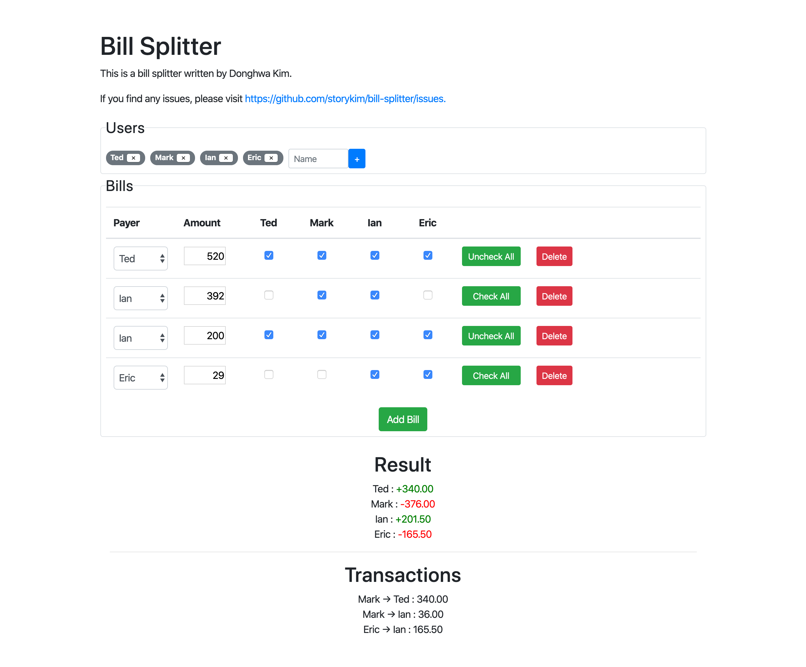

# Bill Splitter
Simple bill splitter with JavaScript.

Check demo [here](https://dutchpay.donghwa.kim).


## Requirements
* Node.js
* NPM

## Installation
```
$ git clone git@github.com:storykim/bill-splitter.git
$ cd bill-splitter
$ npm install 
```

To run the application in develop mode:
```
$ gatsby develop
```

To build the application in order to publish:
```
$ gatsby build
```

## Is the number of transactions minimum?
**No. There is no guarantee that it would be minimal.** This application uses a naïve algorithm to reduce the number of transactions, and it is guaranteed that it would be less than the number of people. However, minimizing the number of transaction is actually [NP-hard](https://en.wikipedia.org/wiki/NP-hardness) problem. To be specific, one can convert the problem into an optimization problem with integer constraint, which is not solved in polynomial time.

## Author
Donghwa Kim([@storykim](https://github.com/storykim))

## License
GPL v3.0